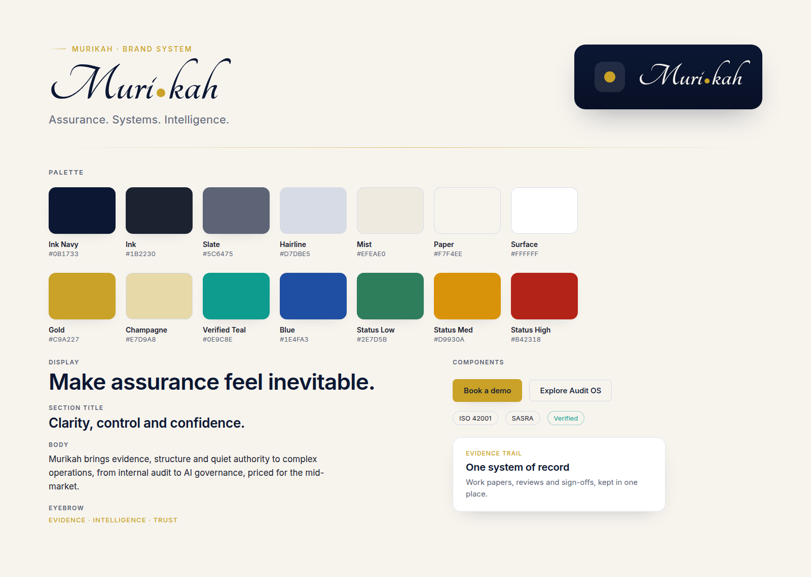

# Murikah brand and design system

> Assurance. Systems. Intelligence.

This is the theme direction for Murikah: a company that brings clarity, control
and confidence to complex operations through internal audit, governance
technology, AI-enabled assurance, risk analytics, systems audits, AI governance
and co-sourced audit. The brand has to sit comfortably in a boardroom, hold up
in front of a regulator, and still read as a modern, AI-native software company.

The system below is grounded in the tokens already defined in
`src/styles/tokens.css` and the signature styles in `src/styles/global.css`, so
it is buildable rather than aspirational. Where it extends the palette, the new
members are given a clear, narrow role and are marked as optional.



---

## 1. Brand mood and personality

Murikah is the quiet expert in the room. It does not raise its voice because it
does not need to. The work is evidence, and the design should feel like evidence:
precise, calm, and impossible to argue with.

Four words anchor every decision.

- **Precise.** Nothing is approximate. Type is set on a scale, space follows a
  rhythm, colour is rationed. If an element cannot justify its place, it is
  removed.
- **Calm.** The interface lowers the reader's pulse. Generous space, soft
  motion, one idea per view. Complexity is handled behind the scenes so the
  surface stays still.
- **Intelligent.** The brand shows its thinking through structure, not
  decoration. Hierarchy, sequence and restraint do the persuading.
- **Trusted.** Every screen looks like it keeps a clean audit trail. Discretion
  over spectacle. The reader should feel that their most sensitive findings are
  safe here.

The personality is closer to a private bank or a research house than a startup.
Confident, understated, and internationally legible. African-rooted in judgement
and market, global in polish. We never reach for pattern, mask or motif to
signal place; credibility carries it.

**Voice in one line:** state what the reader gets, never how the design is
trying to achieve it. No superlatives, no jargon, no noise.

---

## 2. Colour palette

The palette is deliberately small. One deep primary, a warm paper canvas, a
disciplined set of graphite and silver neutrals for structure, and a single
accent that is spent rarely so it always means something. Every value below is a
real token; the extended members carry a narrow role.

### Core

| Role           | Name      | Hex       | Token                 | Use                                                                               |
| -------------- | --------- | --------- | --------------------- | --------------------------------------------------------------------------------- |
| Primary        | Ink Navy  | `#0B1733` | `--color-navy`        | Authority. Footer, one closing band per page, dark product chrome, the logo tile. |
| Primary, deep  | Navy Deep | `#081026` | `--color-navy-deep`   | The far end of navy gradients only.                                               |
| Canvas         | Paper     | `#F7F4EE` | `--color-paper`       | The dominant background. Warm, not clinical.                                      |
| Canvas, raised | Surface   | `#FFFFFF` | `--color-surface`     | Cards and raised panels.                                                          |
| Canvas, sunk   | Mist      | `#EFEAE0` | `--color-paper-shade` | Quiet fills, quotes, inset rows.                                                  |

### Structure neutrals (graphite and silver)

| Role                | Name     | Hex       | Token              | Use                                                                          |
| ------------------- | -------- | --------- | ------------------ | ---------------------------------------------------------------------------- |
| Graphite, text      | Ink      | `#1B2230` | `--color-ink`      | Body text. Never pure black.                                                 |
| Graphite, secondary | Slate    | `#5C6475` | `--color-slate`    | Secondary text, captions, meta.                                              |
| Silver              | Hairline | `#D7DBE5` | `--color-hairline` | The workhorse divider. Grouping is done with hairlines and space, not boxes. |

### Accent and interactive

| Role              | Name      | Hex       | Token               | Use                                                                                                            |
| ----------------- | --------- | --------- | ------------------- | -------------------------------------------------------------------------------------------------------------- |
| Accent            | Gold      | `#C9A227` | `--color-gold`      | The single distinctive highlight. One primary action, the signature light, fine rules. Kept scarce on purpose. |
| Accent, deep      | Gold Deep | `#AE8B1F` | `--color-gold-deep` | Gold hover and active only.                                                                                    |
| Interactive       | Blue      | `#1E4FA3` | `--color-blue`      | Links and quiet actions, where spending gold would be wasteful.                                                |
| Interactive, deep | Blue Deep | `#173C7C` | `--color-blue-deep` | Link hover.                                                                                                    |

### Extended, optional (reserved roles)

These formalise the brief's palette without diluting the marketing look. They
are product and material members, not new marketing colours.

| Role           | Name          | Hex       | Use                                                                                                                                           |
| -------------- | ------------- | --------- | --------------------------------------------------------------------------------------------------------------------------------------------- |
| Verified state | Verified Teal | `#0E9C8E` | Product only. The "assured", "verified", "evidence complete" state in the SaaS. A calm, boardroom teal, never neon, never in marketing pages. |
| Soft gold wash | Champagne     | `#E7D9A8` | A low-opacity gold tint for large light washes and the aperture glow, where solid gold would be too loud.                                     |
| Cool silver    | Silver Mist   | `#C9CFDB` | Slightly deeper than Hairline, for product table rules and inactive controls.                                                                 |

### Product status (RAG), product surfaces only

Risk ratings live inside the product and never appear in marketing UI.

| Level  | Hex       | Token                 |
| ------ | --------- | --------------------- |
| Low    | `#2E7D5B` | `--color-status-low`  |
| Medium | `#D9930A` | `--color-status-med`  |
| High   | `#B42318` | `--color-status-high` |

**Discipline.** White and paper carry roughly 85 to 90 per cent of every
surface. Navy appears at most twice on a page (a closing band and the footer).
Gold is a highlight, never a fill. If a screen feels colourful, it is wrong.

---

## 3. Typography direction

One neutral, Apple-adjacent grotesque does all of the work. Apple devices render
native San Francisco through `-apple-system`; everything else falls back to
self-hosted Inter. This keeps the type crisp on every platform with almost no
font payload.

```
-apple-system, BlinkMacSystemFont, "Inter Variable", "Inter",
"Segoe UI", Roboto, Helvetica, Arial, sans-serif
```

**Principles.**

- Large headings are set tight: snug line height and slightly negative
  letter-spacing, so display type reads as one confident shape rather than
  loose words.
- Body stays calm at a 1.6 line height, measured to roughly 65 to 70 characters
  for comfortable reading.
- Micro-labels (eyebrows, table headers, meta) are 12 to 13px, uppercase, medium
  weight, tracked to about `0.08em`. They orient without shouting.
- Weight range is restrained: regular for body, medium for controls and labels,
  semibold for headings. No black weights, no italics for emphasis.

**Scale** (from `--text-*` tokens; fluid values use `clamp`).

| Token        | Size                                           | Line height | Tracking          | Role                       |
| ------------ | ---------------------------------------------- | ----------- | ----------------- | -------------------------- |
| `display`    | `clamp(1.875rem, 3.5vw, 2.5rem)`               | 1.1         | `-0.02em`         | Hero headline              |
| `title`      | `clamp(1.375rem, 2vw, 1.75rem)`                | 1.15        | `-0.01em`         | Section H2                 |
| `2xl` / `xl` | 21px / 20px                                    | 1.3 / 1.35  | `-0.01em`         | H3                         |
| `lg`         | 19px                                           | 1.5         | 0                 | Lead paragraph             |
| `base`       | `clamp(0.9375rem, 0.5vw + 0.85rem, 1.0625rem)` | 1.6         | 0                 | Body                       |
| `sm`         | 14px                                           | 1.5         | 0                 | Buttons, nav, small labels |
| `xs`         | 12px                                           | 1.5         | `0.08em` (labels) | Fine print, eyebrows       |

**The wordmark.** The logotype is simply "Murikah", set in the same sans at a
confident semibold with slightly tighter tracking (see section 4). No second
typeface is introduced anywhere in the system.

---

## 4. Logo style direction

The mark is a clean wordmark with a single, discreet device beside it, and
nothing else. No shield, no lock, no magnifier, no scales, no literal check.

**Wordmark.** Simply "Murikah", set in the brand sans at semibold with slightly
tight tracking. Clean, modern and internationally legible. It reads as one
confident word, navy on light surfaces and warm paper on navy. It is never
styled as a script, never broken up, and never punctuated.

**The evidence mark.** A single gold aperture dot, a filled circle in Gold
`#C9A227`, sits on a small navy tile to the left of the wordmark. It is the
discreet verification and evidence device: a point of light that reads as
something seen, checked and closed. It supports the wordmark and never interrupts
the readability of "Murikah".

**The companion mark.** Where the wordmark will not fit, at or below about 32px,
the brand uses the tile and dot alone: the gold aperture on the navy tile. This
is the favicon and the app icon, and it carries the brand without a single word.

**Lockups.** Header and footer pair the tile with the wordmark. The social card
carries the wordmark, the tagline in sans, and one line of context. That is the
full set. There is no secondary emblem to manage.

---

## 5. Website homepage visual style

The homepage should feel like the cover of a well-made annual report that
happens to be interactive.

- **Canvas.** Paper and white dominate. Sections alternate between paper,
  surface and a sunk mist, separated by hairlines and space rather than boxes.
- **Hero.** A light field with the faintest wash of gold and blue in the
  corners. A confident display headline, a calm lead, one gold primary action
  and one quiet ghost action. Alongside it, a light product panel that shows one
  real thread of the work rather than a screenshot dump.
- **The signature light.** One restrained gold motif recurs and is never
  scattered: a fine gold beam as a structural rule, and a single soft aperture
  glow behind one key headline per page. Used once, it reads as craft; used
  twice, as noise.
- **Cards.** White or paper, a fine hairline, a soft navy-tinted shadow, and a
  gentle lift on hover. Generous internal padding. Content leads, chrome
  recedes.
- **Rhythm.** Large section padding, wide gaps between cards, a single clear
  idea per section with an eyebrow, a title, and room to breathe.
- **Closing.** At most one navy band near the end, then the dark footer. The eye
  should arrive at the call to action rested, not fatigued.

---

## 6. SaaS dashboard visual style

The Assurance OS is the operating layer for assurance work, so the product
should feel like a calm instrument, not a busy console. The marketing restraint
carries straight into the app.

- **Shell.** A light working canvas with a quiet left rail and a slim top bar.
  Navy is reserved for the rail or header chrome, not spread across the content.
- **Cards and panels.** The same hairline-and-soft-shadow language as marketing.
  Glass-like panels are allowed sparingly on the navy chrome (a low-opacity white
  fill with a hairline), never stacked.
- **Tables and evidence logs.** Silver Mist rules, generous row height, tabular
  numerals, and a clear resting, hover and selected state. Density is a setting,
  not a default; the default is calm.
- **Risk heatmaps and analytics.** Built from the RAG status set on a light
  ground, with plenty of surrounding space so a red cell reads as a signal, not
  an alarm. Charts are line and area first, restrained fills, one accent per
  view. Verified Teal marks assured and closed states.
- **Forms and workflows.** One column, one decision at a time. Labels above
  fields, quiet hairline inputs, a single gold primary action per step. Progress
  is shown as a thin line, not a carnival.
- **Board and committee reporting.** Report views read like a printed pack:
  strong hierarchy, wide margins, tabular figures, and nothing on the page that
  would not survive being handed to a director.

The feeling to protect: complex governance work has been made to look simple,
and the simplicity is earned.

---

## 7. Pitch deck visual style

The deck is the brand in presentation form. It should look like it was set by a
firm that audits presentations for a living.

- **Grid.** Wide margins, one idea per slide, a consistent baseline. Air is the
  most expensive material in the deck; spend it.
- **Covers and section breaks.** Navy field, the signature aperture behind a
  single line, the wordmark small in a corner. Restraint signals seniority.
- **Content slides.** Paper ground, a tracked eyebrow, one confident title, and
  either a single chart or a short, structured list. Never both fighting for the
  eye.
- **Data.** Muted, precise, labelled directly on the mark rather than in a
  distant legend. One accent to carry the point of the slide. Tabular figures
  throughout.
- **Type.** The same sans and the same scale as the site, so the deck and the
  product are visibly one company.
- **Rule of thumb.** If a slide needs a second colour to make its point, the
  point is not clear enough yet.

---

## 8. Iconography style

Icons are quiet wayfinding, not illustration.

- **Construction.** A single consistent stroke weight (around 1.75px on a 24px
  grid), round caps and joins, generous internal space, drawn on the same grid
  as the check in the mark.
- **Colour.** Ink or slate at rest, navy or gold only to signal state or the one
  primary action. Never multicoloured.
- **Style.** Line, not filled, with the occasional small filled accent (a dot, a
  tick) that echoes the evidence mark. Geometric and even, never hand-drawn or
  playful.
- **Restraint.** Prefer a word to a weak icon. An icon earns its place only when
  it speeds recognition. Avoid the audit clichés entirely: no shields, locks,
  magnifiers, gavels or scales.

---

## 9. Motion and interaction principles

Motion is used to explain, never to entertain. It should feel like the interface
settling into place.

- **One easing curve.** `cubic-bezier(0.22, 1, 0.36, 1)`, a soft deceleration,
  used everywhere so the whole system moves with one hand.
- **Small distances, short durations.** Reveals rise about 8 to 14px over 0.5 to
  0.7s. Hovers lift a few pixels. Nothing slides across the screen.
- **Feedback under the Doherty threshold.** Interactive feedback in about 150ms,
  so the product always feels instant.
- **Purposeful sequence.** A hero rises in a short, staggered order to guide the
  first read. Content reveals once on entry, then stays still. No looping,
  parallax or attention-seeking motion.
- **Respect the reader.** `prefers-reduced-motion` removes all of it and shows
  the final state immediately. Motion is always an enhancement, never a
  dependency; every view is complete without it.

---

## 10. Design rules for a premium, uncluttered look

Ten rules that keep the multibillion-dollar feel intact. When in doubt, remove
something.

1. **White and paper lead.** Roughly 85 to 90 per cent of any surface is light.
   Dark fields are moments, not backgrounds.
2. **Gold is rationed.** One primary action per view, plus the fine signature
   light. Gold is a highlight, never a fill or a mood.
3. **Group with space and hairlines, not boxes.** If a border can become a
   hairline or a gap, it should.
4. **One idea per view.** Every section and slide earns its place with a single
   clear point.
5. **Type on the scale, always.** No arbitrary sizes. Large headings tight, body
   calm, labels tracked.
6. **Space is a feature.** Generous padding and wide gaps are the look. Crowding
   reads as cheap.
7. **Depth is a whisper.** Soft, navy-tinted shadows and fine hairlines. No hard
   drop shadows, no heavy borders, no glow.
8. **Numbers are set with care.** Tabular numerals, aligned columns, direct
   labels. Data is where trust is won or lost.
9. **Copy states the benefit, not the mechanism.** Never name the technique on
   the surface. Plain English, British and Kenyan spelling, no superlatives, no
   filler.
10. **Subtract before you add.** The most premium move available is almost always
    to take something away. A screen is finished when nothing else can be
    removed without losing meaning.

---

## Appendix: mapping to the codebase

- Colour, type, spacing, radius, shadow and motion tokens live in
  `src/styles/tokens.css` (Tailwind v4 `@theme`), available as utilities
  (`bg-navy`, `text-slate`, `text-title`) and raw custom properties.
- The signature elements (`.beam`, `.aperture`, `.grain`, `.eyebrow`,
  `.premium-card`, the `navy-rich` field) live in `src/styles/global.css`.
- Section tones (paper, surface, shade, navy, navy-rich) are set through
  `Section.astro`; the one gold action is `Button` `variant="primary"`.
- The wordmark and companion mark are `Logo.astro`; the wordmark uses the same
  brand sans as the rest of the system, with no second typeface.

Anything added to the system should be expressible as a token or a small
composition of existing ones. If a new screen needs a value that is not in the
tokens, the first question is whether the screen is right, not whether the token
is missing.
